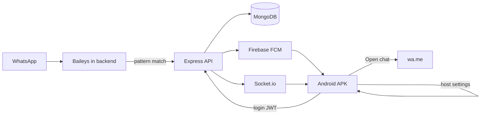

# WhatsApp → Backend → APK relay

## Tanlovlar (qat’iy)
- WhatsApp: **Baileys**
- Backend: **Node.js** (Express + Socket.io + Firebase Admin FCM)
- Auth: **backendda** — register/login, bcrypt password, **JWT** (HTTP + Socket.io)
- DB: **MongoDB** (Mongoose)
- Infra: **Docker Compose** — `backend` + `mongo`
- APK: host sozlamalari + login + matched list
- Loyiha: `wa-relay` (~/Projects yoki ~/Developer, aks holda `~/wa-relay`)
- Monorepo: `backend/` + `android/` + `docker-compose.yml`

**Ogohlantirish:** Baileys norasmiy; bloklash xavfi. Asosiy shaxsiy raqamda ishlatilmasin.

## Arxitektura

## Docker

- `docker-compose.yml`: `mongo`, `backend`
- Volumes: `mongo_data`, `baileys_auth`
- Env: `MONGODB_URI`, `JWT_SECRET`, `PATTERNS`, FCM credentials
- Port: `3000`; `docker compose up --build`

## Backend auth (barcha auth shu yerda)

- Collections: `users` (email/username, passwordHash), `devices` (userId, fcmToken), `messages`
- `POST /auth/register`, `POST /auth/login` → JWT
- Himoyalangan: `GET /messages`, `POST /devices/register`, Socket.io connect
- Middleware: `Authorization: Bearer <token>`
- Socket.io: `auth.token` bilan bir xil JWT
- Seed/admin: birinchi user register orqali (v1)

## Backend WhatsApp + push

1. Baileys QR (`/qr` yoki log), session volume
2. Pattern match → `messages` ga yozish → Socket.io `message:matched` (auth’d userlarga) → FCM registered devices
3. Payload: text, senderPhone, senderName, chatId, isGroup, timestamp, messageId, waLink

## Android (`android/`)

1. **Sozlamalar ekrani (host)**
   - Backend base URL (masalan `http://192.168.x.x:3000`)
   - Saqlash: DataStore / SharedPreferences
   - Login/Socket/FCM shu URL dan foydalanadi; o‘zgarsa qayta ulanish

2. **Auth UI**
   - Login (va register, agar kerak)
   - Token local saqlash; 401 → login ga qaytarish
   - Parol/hash faqat backendda

3. FCM + Socket.io (JWT) live list
4. **“WhatsAppda ochish”** → `https://wa.me/<phone>`
5. Compose: Settings → Login → Messages

## Ishga tushirish tartibi

1. Repo + Docker + Mongo
2. Auth + Baileys + FCM/Socket
3. APK: host settings, login, list, open chat
4. E2E: compose → register/login → QR → match → push/live → WhatsApp

## Scope (v1)
- Bitta WhatsApp session (serverda)
- Faqat text + regex pattern
- Oddiy email/username + password JWT (OAuth yo‘q)
- Host URL faqat APK sozlamalarida
